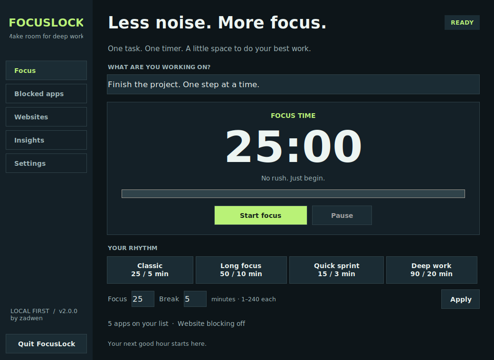

<div align="center">


# FocusLock
### Less noise. More focus.

A local-first focus timer and distraction blocker for **Windows and Linux**.

[Windows .exe](https://github.com/zadwen/FocusLock/releases/download/v2.0.0/FocusLock.exe) · [Linux download](https://github.com/zadwen/FocusLock/releases/download/v2.0.0/FocusLock-linux-x86_64) · [All releases](https://github.com/zadwen/FocusLock/releases)

</div>

> **v2 release status:** the links above require the `v2.0.0` release workflow to finish. If the assets are not there yet, use the source instructions below. Maintainers: see [Publishing the downloads](#publishing-the-downloads).



Built by **zadwen** to make it easier to stop opening distracting apps and finish the task in front of you.

## What's new in v2

- A redesigned, resizable interface with a sidebar, clear timer, custom durations, and instant dark/light switching.
- Windows and Linux app blocking, without third-party runtime Python packages.
- Four presets, custom focus/break lengths, password-protected pause and stop.
- Blockers release on breaks and pauses, then resume with focus.
- Accurate focus statistics that exclude pauses and breaks; streaks expire properly.
- Validated domains, salted password hashes, atomic saves, and a single-instance guard.
- Automated tests and Windows/Linux release builds in the correct GitHub Actions folder.

## Install on Windows — easiest method

**Windows 10/11, 64-bit. No Python installation needed for the `.exe`.**

1. Open [Releases](https://github.com/zadwen/FocusLock/releases) and select **v2.0.0** or a newer version.
2. Under **Assets**, download **`FocusLock.exe`**. Do not choose “Source code” if you just want to run the app.
3. Move the file to a permanent folder, such as `Documents\FocusLock`.
4. Double-click **FocusLock.exe**. It is portable: no installer wizard is required.
5. Optional: right-click it → **Send to → Desktop (create shortcut)**.

The executable is not code-signed. Windows may display a reputation warning. Check that the download came from this repository and compare its SHA-256 with the release's `SHA256SUMS-Windows.txt`; do not disable Windows security globally. In PowerShell:

```powershell
Get-FileHash "$HOME\Downloads\FocusLock.exe" -Algorithm SHA256
```

**Website blocking:** close FocusLock, then right-click `FocusLock.exe` → **Run as administrator**. Enable website blocking in the app. Ordinary app blocking and the timer do not require administrator rights. Elevating with another account also changes which account's configuration is used.

**Update:** quit FocusLock completely, replace the old `.exe`, and reopen it. Settings stay in `%APPDATA%\FocusLock`. Startup uses the executable's location, so toggle “Open FocusLock when I sign in” off and on if you move it.

## Install on Linux

### Option A: downloadable binary

The release binary targets **x86-64 Linux with glibc 2.35+**, built on Ubuntu 22.04. It is intended for Ubuntu 22.04+, Zorin OS 17/18 and compatible desktops. A graphical desktop with X11 or XWayland is required. ARM and older distributions should use source. These are compatibility targets, not a claim that every distribution was physically tested.

1. Download **`FocusLock-linux-x86_64`** from [Releases](https://github.com/zadwen/FocusLock/releases).
2. In your downloads folder, run:

```bash
chmod +x FocusLock-linux-x86_64
./FocusLock-linux-x86_64
```

No Python installation is needed for the binary. On minimal desktops you may need Tk's native X11 libraries; on Ubuntu/Zorin, `sudo apt install python3-tk` supplies them. If Wayland cannot display the window, make sure XWayland is installed.

To verify a downloaded release in the same folder as `SHA256SUMS-Linux.txt`:

```bash
sha256sum --ignore-missing -c SHA256SUMS-Linux.txt
```

**Included upgrade bundle:** if you received this project as `FocusLock-v2-upgrade.zip`, its `FocusLock/dist/FocusLock-linux-x86_64` is a local test build requiring glibc 2.39+ (Ubuntu 24.04 / Zorin 18). The GitHub release workflow targets glibc 2.35+.

### Option B: install from source — recommended on Zorin/Ubuntu

Open Terminal and run:

```bash
sudo apt update
sudo apt install -y git python3 python3-tk

git clone https://github.com/zadwen/FocusLock.git
cd FocusLock
python3 src/focuslock.py
```

For the upgraded source ZIP, extract it and open a terminal in its `FocusLock` folder instead of cloning. There is no `pip install` step for running the app.

**Add it to your applications menu:**

```bash
python3 scripts/install_linux.py
```

Run the installer **without sudo**. Then search for **FocusLock** in the applications menu, or launch it with:

```bash
~/.local/bin/focuslock
```

The installer copies the app to `~/.local/share/focuslock` and creates a per-user launcher. To update that installation, close FocusLock, obtain the new source, and rerun the installer.

Other distributions:

```bash
# Fedora
sudo dnf install python3 python3-tkinter git

# Arch Linux
sudo pacman -S python tk git
```

**Linux website-blocking limitation:** `/etc/hosts` is normally writable only by root. This release does not install a privileged background service or silently request root access. Run the app normally for the timer and app blocking; leave website blocking off unless hosts access is explicitly managed by your system administrator. Do not make `/etc/hosts` world-writable or run the whole desktop app as root. Enabling website blocking without permission reports an error while app blocking continues. Windows supports the optional website blocker through “Run as administrator.”

### Uninstall the per-user Linux installation

First stop the session, disable “Open FocusLock when I sign in,” and quit the app. Then:

```bash
rm -f ~/.local/bin/focuslock
rm -f ~/.local/share/applications/focuslock.desktop
rm -f ~/.config/autostart/focuslock.desktop
rm -rf ~/.local/share/focuslock
```

Settings and stats in `~/.config/FocusLock` are preserved. If you set `XDG_CONFIG_HOME`, use that directory instead of `~/.config` for autostart and settings.

## Your first focus session

1. Open **Blocked apps** and review the list. Use exact process names, for example `discord.exe` on Windows or `Discord` on Linux. Use Task Manager → Details on Windows, or `ps -u "$USER" -o pid,comm,args` on Linux, to identify processes.
2. Save work in those apps. Matching apps are closed while focus is active; unsaved work can be lost.
3. On **Focus**, enter your task and pick a preset, or enter custom minutes and select **Apply**.
4. Select **Start focus**. Breaks begin automatically and temporarily release blockers.
5. Use **Pause** for an interruption, **Resume** to continue, or **End session** to save your focus time.
6. Check **Insights** for focus time, session counts, and streaks. Sessions are recorded on the date they end.

The session repeats until you end it. A session with less than one second of focus is not counted. A crash or force-quit can lose the current session's unsaved stats; previous saved sessions are retained. Sleep handling follows the OS monotonic clock; pause before suspending your computer if you want strictly attended focus time.

### Passwords and window behavior

- Set a session password in **Settings** to guard pause and stop.
- A recovery password also unlocks the session. An existing recovery password is required to replace or remove that recovery password.
- Existing v1 password hashes continue to verify. Changing a password stores it using salted PBKDF2-SHA256.
- Minimize normally to continue working. With “Minimize to the taskbar when I close the window” enabled, the close button minimizes instead of quitting. Restore from the taskbar/dock.
- There is **no system tray dependency**. Use **Quit FocusLock** in the sidebar to exit explicitly.

FocusLock is a self-control tool, not tamper-resistant parental control. A user who can terminate the process, edit its configuration, or administer the machine can bypass it.

## Website blocking and recovery

The blocker edits only sections between `# FocusLock-START` and `# FocusLock-END`. It adds both IPv4 and IPv6 loopback entries and a `www` variant. It does not wildcard every subdomain. Browser caches, existing connections, proxies, VPNs and alternate DNS behavior can limit effectiveness; this is not a firewall.

A first-use backup is kept beside the hosts file as `hosts.focuslock-backup`. Unrelated entries are preserved. Broken markers cause a visible error instead of guessing which lines to delete.

On normal pause, break, stop, or quit, FocusLock removes its rules. If a crash leaves sites blocked, **stop any running FocusLock session first**, then relaunch with hosts write permission and accept the recovery prompt, or use:

**Windows, from an Administrator PowerShell:**

```powershell
& "C:\path\to\FocusLock.exe" --recover-hosts
```

The Windows binary has no console window; reopen the app or inspect the hosts file afterward. For visible diagnostics, run the source command from an elevated terminal:

```powershell
py -3 src\focuslock.py --recover-hosts
```

**Linux, from the trusted source folder:**

```bash
sudo python3 src/focuslock.py --recover-hosts
```

This command performs only recovery and exits; it does not start the GUI. It removes FocusLock-marked entries, not your entire hosts file. If markers are malformed, inspect the file and backup manually.

## Run or build from source on Windows

Install [Python 3.10+](https://www.python.org/downloads/windows/) with the Python launcher and Tcl/Tk options enabled, and [Git](https://git-scm.com/downloads/win) if cloning.

```powershell
git clone https://github.com/zadwen/FocusLock.git
cd FocusLock
py -3 src\focuslock.py
```

To create the standalone `.exe`:

```powershell
.\build.bat
```

The script creates an isolated build environment, installs pinned build dependencies, runs tests, and writes **`dist\FocusLock.exe`**. It stops on errors. Build Windows executables on Windows; PyInstaller is not a Windows cross-compiler on Linux.

On Linux, install `python3-venv` and Tk, then:

```bash
sudo apt install python3-venv python3-tk
bash build.sh
```

Output: `dist/FocusLock-linux-x86_64`. Build on x86-64 Linux; the binary inherits the build system's glibc compatibility. The workflow uses Ubuntu 22.04 to target a wider range of distributions.

## Publishing the downloads

The workflow is now at **`.github/workflows/build.yml`**. It tests and builds on Windows and Linux, uploads build artifacts, and publishes release assets on version tags.

1. Commit the upgraded files to this repository. See [UPGRADE.md](docs/UPGRADE.md) for replacing the old duplicate layout.
2. On GitHub, open **Actions → Build and release FocusLock → Run workflow** to test both builds first.
3. Download the Windows artifact, extract it, and manually check `FocusLock.exe` on a Windows computer. Check Linux as well.
4. When ready, push a version tag:

```bash
git tag v2.0.0
git push origin v2.0.0
```

5. The tag workflow creates a release after both builds pass. Its assets are `FocusLock.exe`, `FocusLock-linux-x86_64`, `FocusLock-source.zip`, and platform-specific SHA-256 files. The download links at the top then work.

Do not reuse an existing version tag for unrelated code; choose a new version and update the README links. Tag releases grant `contents: write` only to the publishing job. PR builds have read-only repository permissions.

## Troubleshooting

| Problem | What to do |
|---|---|
| “No module named tkinter” | Install `python3-tk` on Ubuntu/Zorin, or enable Tcl/Tk in the Windows Python installer. |
| “No display name” | Launch from a graphical desktop session, not a headless SSH shell. |
| A second copy won't open | Restore the first copy from the taskbar/dock. The OS automatically releases the single-instance lock when the app exits. |
| An app doesn't close | Check its exact process name. Linux blocks only processes owned by the current user. Elevated/protected Windows processes may deny access; the app reports this. |
| Settings won't save | Check write access to the data folder. Invalid JSON is backed up before defaults are loaded. |
| Website permission error | On Windows run as administrator; on Linux see the explicit limitation above. |
| Website still opens | Check subdomains, cached connections, proxy/VPN settings and browser behavior. |
| Startup stopped working | Keep the app in a permanent folder and toggle startup off/on after moving it. |
| Old stats look inflated | v1 counted pauses and breaks. Existing totals are preserved; v2 cannot reconstruct past attended focus time. |
| Linux binary won't run | Check `uname -m` is `x86_64` and glibc is recent enough, or run from source. |

## Development and validation

```bash
python3 -m unittest discover -s tests -v
```

UI tests require a display. On headless Linux, use `xvfb-run -a python3 -m unittest discover -s tests -v`. Tests mock process termination and use temporary hosts files; they do not kill your apps or modify system hosts.

See [VALIDATION.md](docs/VALIDATION.md) for what was actually tested and what still requires native release checks.

```text
src/                  UI, timer/storage logic, OS integration
scripts/              Build, release packaging, per-user Linux installer
tests/                Behavior and UI regression tests
assets/               App icon
docs/                 Upgrade instructions and verification report
.github/workflows/    Windows/Linux build and release automation
```

## Technical references

- [Python tkinter documentation](https://docs.python.org/3/library/tkinter.html)
- [Python monotonic clock](https://docs.python.org/3/library/time.html#time.monotonic)
- [PyInstaller requirements and platform limitations](https://pyinstaller.org/en/stable/)
- [GitHub Actions workflow syntax](https://docs.github.com/en/actions/reference/workflows-and-actions/workflow-syntax)
- [GitHub release creation](https://cli.github.com/manual/gh_release_create)
- [Freedesktop autostart specification](https://specifications.freedesktop.org/autostart-spec/latest/)

## License

[MIT](LICENSE). Made by [zadwen](https://github.com/zadwen).
